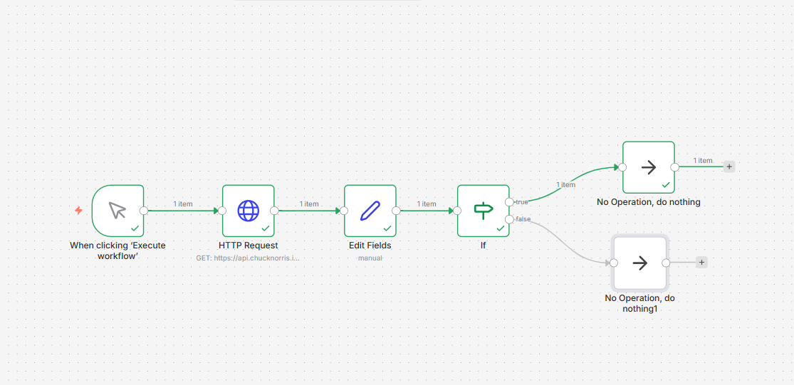

# Daily Joke Aggregator 🤖

## The Problem
Many professionals start their day looking for a quick mental break. However, browsing the internet for jokes wastes valuable time.

## The Solution
I built a fully automated workflow using **n8n** that:
- Fetches a random joke from a public API.
- Extracts just the punchline (removes all the messy JSON code).
- Routes the joke through conditional logic (IF the joke contains a specific word, it goes to Branch A; otherwise, Branch B).
- *(Future Upgrade)* Automatically delivers the joke via Email or Slack every morning at 8 AM.

## Technology Stack
- **n8n** (Workflow Automation Engine)
- **Chuck Norris API** (Public REST API)
- **JSON Data Parsing** (Set Node for data extraction)
- **Conditional Logic** (IF Node for decision routing)

## Visual Workflow

## What This Proves
This project demonstrates my ability to:
1. Integrate external REST APIs.
2. Transform and clean raw JSON data.
3. Implement business logic (IF/THEN conditions) inside an automation pipeline.
4. Design scalable automation architectures.

---
**Built by Adil Hassam**
