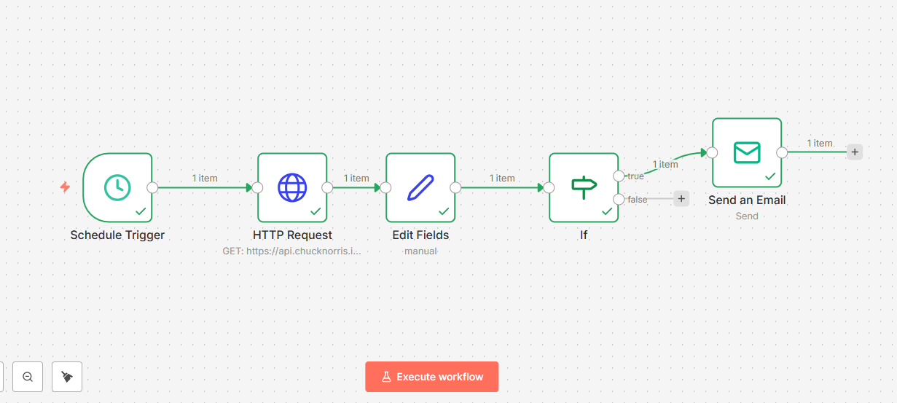

# Morning Email Bot ⏰📧

## The Problem
I wanted to start my day with a laugh, but I kept forgetting to browse joke websites. 

## The Solution
I built a fully automated email bot using **n8n** that:
- Runs automatically every morning at **8:00 AM** (Schedule Trigger).
- Fetches a fresh joke from a public API.
- Cleans the raw JSON data to extract just the punchline.
- Sends a beautifully formatted HTML email directly to my Gmail inbox.

## Technology Stack
- **n8n** (Workflow Automation)
- **Chuck Norris API** (Public REST API)
- **Gmail SMTP** (Email Integration)
- **Schedule Trigger** (Unattended Automation)

## Visual Workflow

## Key Features Demonstrated
1. **Scheduled Automation** - Runs without human intervention.
2. **External API Integration** - Pulls live data from the internet.
3. **SMTP Email Setup** - Authenticates and sends emails via Gmail.
4. **Conditional Logic** - Routes data based on content (IF node).
5. **HTML Email Formatting** - Sends visually appealing emails.

---
**Built by Adil Hassam**
